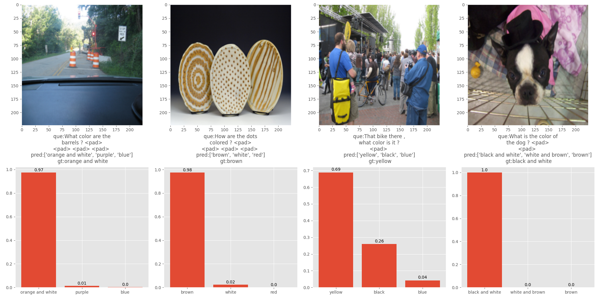

# Combining Vision and Language: Visual Question Answering (EE641 Project)



# Prerun script

* Run the below bash script to create required directories to store datasets and outputs generated by training and testing scripts
* This script will create the following directories
    * `data/`
    * `plots/baseline_outputs`
    * `plots/rephrasings_outputs`
    * `saved_models/`

```bash
bash prerun.sh
```

# Datasets used

## VQA 2.0 Dataset

Clone the datasets using the `wget` links mentioned below

* Training images, questions and annotations

```bash
wget http://images.cocodataset.org/zips/train2014.zip -P data/
wget https://s3.amazonaws.com/cvmlp/vqa/mscoco/vqa/v2_Questions_Train_mscoco.zip -P data/
wget https://s3.amazonaws.com/cvmlp/vqa/mscoco/vqa/v2_Annotations_Train_mscoco.zip -P data/
```

* Validation images, questions and annotations

```bash
wget http://images.cocodataset.org/zips/val2014.zip -P data/
https://s3.amazonaws.com/cvmlp/vqa/mscoco/vqa/v2_Questions_Val_mscoco.zip -P data/
https://s3.amazonaws.com/cvmlp/vqa/mscoco/vqa/v2_Annotations_Val_mscoco.zip -P data/
```

* Testing images, questions (Annotations for testing set are not available for public download)

```bash
wget http://images.cocodataset.org/zips/test2015.zip -P data/
wget https://s3.amazonaws.com/cvmlp/vqa/mscoco/vqa/v2_Questions_Test_mscoco.zip -P data/
```

## VQA-Rephrasings Dataset

* This dataset uses the same images as the VQA 2.0 dataset but contains 3 rephrasings for ~40k questions
* The goal of this dataset is to attack the model with rephrased questions

```bash
wget https://facebookresearch.github.io/VQA-Rephrasings/assets/data/vqa_rephrasings.tar.gz -p data/
```

## Running the main file to predict using the trained model

### Command line
* Use the `main.py` file to use the model to predict on a given image
* Provide two system arguments 
    * The **absolute** path of the image
    * The question

**Example:**
```bash
python main.py "/ee641-project/ee641-project/data/train2014/COCO_train2014_000000012728.jpg" "What is the color of the airplane?"
```

### IPython Widgets

* Run the `main.ipynb` notebook to use the GUI to upload an image and question.
